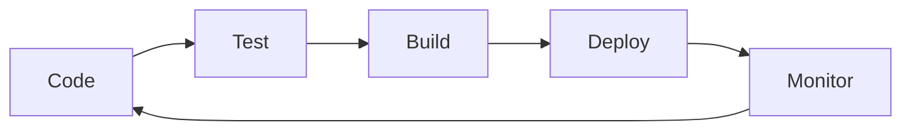

<!--
  Professional GitHub Profile README for Piyush Soni
  Modern, recruiter-friendly, and clean Markdown structure
-->

# Piyush Soni

**Full Stack Developer | Cloud Enthusiast | Java & React Specialist**

<p align="left">


</p>

---

## 👋 About Me

I'm **Piyush Soni**, a passionate developer who transforms ideas into digital reality. I specialize in building scalable, high-quality web applications using Java, Spring Boot, React, and cloud technologies. I thrive in collaborative environments and love solving real-world problems with code.

---

## 🚀 Why Hire Me?

- **Proven Full Stack Skills:** Java, Spring Boot, React, Next.js, TypeScript
- **Cloud Ready:** Google Cloud, Docker, Kubernetes, CI/CD
- **Clean Code & Best Practices:** Focused on maintainability and performance
- **Continuous Learner:** Always upskilling and adapting to new tech
- **Strong Communicator:** Experience working in diverse, distributed teams

---

## 🛠️ Tech Stack

**Languages:** Java, JavaScript, TypeScript, C, C++, SQL  
**Frameworks:** Spring Boot, React, Next.js, Express.js  
**Cloud & DevOps:** Google Cloud, Docker, Kubernetes, GitHub Actions  
**Databases:** MySQL, MongoDB, PostgreSQL  
**Tools:** VS Code, IntelliJ, Git, Postman, Figma

---

## � Achievements

- **Full Stack Development - Certified** (Groot Software Academy)
- **Google Cloud Arcade Level 3**
- **100 Days of Java Challenge - Completed**
- **Open Source Contributor**

---

## 📈 GitHub Stats

<p align="center">
  
  
</p>

---

## 💼 Projects

- [C-Programs](https://github.com/Piyush64-bit/C-Programs): Foundation-level C programming
- [CPP-Programs](https://github.com/Piyush64-bit/CPP-Programs): Advanced C++ and DSA
- [Java-Programs](https://github.com/Piyush64-bit/Java-Programs): 100 Days of Java
- [AdvanceJava-Programs](https://github.com/Piyush64-bit/AdvanceJava-Programs): Enterprise Java, Spring Boot

---

## 📚 Learning & Growth

- **Currently Learning:** Microservices, Advanced Cloud, System Design
- **Focus Areas:** Performance Optimization, Design Patterns, DevOps

---

## 📬 Contact

- **Email:** piiyush.sonii@outlook.com
- **LinkedIn:** [piyush64bit](https://www.linkedin.com/in/piyush64bit)
- **Portfolio:** [piyushportfolio.live](https://piyushportfolio.live)

---

<sub>Last updated: August 2025</sub>

<!-- Cyberpunk Style Typing SVG -->


<!-- Animated Wave -->


<!-- Hacker-style Profile Animation -->


<!-- Tech Stack Ticker -->


<!-- Gradient Line -->


<!-- Profile Views with Animation -->


<!-- Social Media Preview -->
<p>
  <a href="https://piyushportfolio.live"></a>
  <a href="https://www.linkedin.com/in/piyush64bit"></a>
  <a href="mailto:piiyush.sonii@outlook.com"></a>
</p>

<!-- Live Stats Dashboard -->


<!-- Current Status Indicators -->
<br><br>


</div>

<!-- Animated Divider -->


---

## âš¡ Live Coding Activity & System Stats

<div align="center">

<!-- Terminal Activity Monitor -->


</div>

<!-- Live Metrics Dashboard -->
<table>
<tr>
<td width="33%" align="center">

### 🔥 **Current Sprint**


</td>
<td width="33%" align="center">

### 📊 **Language Usage**


</td>
<td width="33%" align="center">

### 🚀 **Contribution Streak**


</td>
</tr>
</table>

<!-- Real-time System Monitor -->
<div align="center">

### 💻 **System Resource Monitor**
```bash
╭─ piyush@dev-machine ~/projects
╰─$ system_monitor --live
┌─────────────────────────────────────────────────────────────┐
│ Process Monitor                                  [██████████] │
├─────────────────────────────────────────────────────────────┤
│ ☕ Coffee Levels:     ████████████████████████ 95%         │
│ 🧠 Creativity:       ██████████████████████   88%          │
│ 💡 Problem Solving:  ████████████████████████ 98%         │
│ 🚀 Productivity:     ███████████████████████  92%          │
│ 🔥 Passion:          ████████████████████████ 100%        │
└─────────────────────────────────────────────────────────────┘
```

<!-- Live Commit Activity -->


</div>


---

## 📚 Learning Laboratory

<div align="center">


*These repositories aren't just practice — they're my **digital evolution** documented in code.*

</div>

<table>
<tr>
<td align="center" width="25%">

##  About Me

<!-- Real-time Terminal Display -->
<div align="center">

</div>

<table>
<tr>
<td width="40%">

<div align="center">
  <!-- Animated Developer Avatar -->
  
  
  <!-- Dynamic Code Status -->
  
</div>

</td>
<td width="60%">

### 🚀 Mission Statement
> *I'm **Piyush** — a passionate developer who transforms ideas into digital reality. I don't just write code; I craft experiences that resonate with users and solve real-world challenges.*

<!-- Interactive Terminal Output -->
<details>
<summary>🎯 <strong>./run_passion_analysis.sh</strong></summary>
<br>

```bash
#!/bin/bash
# Passion Analysis Script v2.0

echo "Analyzing developer DNA..."
passion_level="MAXIMUM"
coffee_dependency="CRITICAL"
debugging_skill="LEGENDARY"

echo "Results:"
```

```javascript
const piyush = {
    passion: ["Frontend Wizardry", "Backend Architecture", "Cloud Innovation"],
    currentFocus: "Building scalable solutions with modern tech",
    lifePhilosophy: "Code with purpose, learn with curiosity",
    funFact: "I debug with coffee and deploy with confidence! ☕",
    
    // Tech Stack DNA
    preferredOS: "Linux > Windows",
    IDE: "VS Code + IntelliJ IDEA",
    debuggingMethod: "console.log() && System.out.println()",
    favoriteBracket: "{ } // Because they hug my code ❤️"
};

// Recursive learning function
function continuousLearning() {
    while(true) {
        learnNewTech();
        buildCoolStuff();
        shareKnowledge();
    }
}
```

**Core Expertise & Power Level:**
- ⚛️ **Frontend Mastery** → React, TypeScript, Next.js `[████████████] 95%`
- ☕ **Backend Engineering** → Java, Spring Boot, APIs `[██████████░] 90%`
- 🐬 **Data & Cloud** → MySQL, MongoDB, GCP `[████████░░░] 85%`
- 🚀 **DevOps Culture** → CI/CD, Kubernetes, Docker `[███████░░░░] 75%`

</details>

</td>
</tr>
</table>

<div align="center">
  
### 💭 Dev Mantra & Philosophy
<!-- Matrix-style Code Rain -->


<!-- Live System Monitor -->
<table>
<tr>
<td align="center">

</td>
<td align="center">

</td>
<td align="center">

</td>
<td align="center">

</td>
</tr>
</table>

</div>

<<<<<<< HEAD


---

## 🎯 Current Focus & Growth

<div align="center">


</div>

=======
<!-- Matrix-style Background -->


<!-- Cyberpunk Style T- 🤖 Machine Learning Fundamentalsping  -->


<!-- Animated Wave -->


<!-- Hacker-style Profile Animation -->


<!-- Tech Stack Ticker -->


<!-- Gradient Line -->


<!-- Profile Views with Animation -->


<!-- Social Media Preview -->
<p>
  <a href="https://piyushportfolio.live"></a>
  <a href="https://www.linkedin.com/in/piyush64bit"></a>
  <a href="mailto:piiyush.sonii@outlook.com"></a>
</p>

<!-- Live Stats Dashboard -->


<!-- Current Status Indicators -->
<br><br>


</div>

<!-- Animated Divider -->


## ⚡ Live Coding Activity & System Stats

<div align="center">

<!-- Terminal Activity Monitor -->


</div>

<!-- Live Metrics Dashboard -->
<table>
<tr>
<td width="33%" align="center">

### 🔥 **Current Sprint**


</td>
<td width="33%" align="center">

### 📊 **Language Usage**


</td>
<td width="33%" align="center">

### 🚀 **Contribution Streak**


</td>
</tr>
</table>

<!-- Real-time System Monitor -->
<div align="center">

### 💻 **System Resource Monitor**
```bash
╭─ piyush@dev-machine ~/projects
╰─$ system_monitor --live
┌─────────────────────────────────────────────────────────────┐
│ Process Monitor                                  [██████████] │
├─────────────────────────────────────────────────────────────┤
│ ☕ Coffee Levels:     ████████████████████████ 95%         │
│ 🧠 Creativity:       ██████████████████████   88%          │
│ 💡 Problem Solving:  ████████████████████████ 98%         │
│ 🚀 Productivity:     ███████████████████████  92%          │
│ 🔥 Passion:          ████████████████████████ 100%        │
└─────────────────────────────────────────────────────────────┘
```

<!-- Live Commit Activity -->


</div>


## 📚 Learning Laboratory

<div align="center">


*These repositories aren't just practice — they're my **digital evolution** documented in code.*

</div>

<!-- Hacker-style Profile Animation -->


<!-- Tech Stack Ticker -->


<!-- Gradient Line -->


<!-- Profile Views with Animation -->


<!-- Social Media Preview -->
<p>
  <a href="https://piyushportfolio.live"></a>
  <a href="https://www.linkedin.com/in/piyush64bit"></a>
  <a href="mailto:piiyush.sonii@outlook.com"></a>
</p>

<!-- Live Stats Dashboard -->


<!-- Current Status Indicators -->
<br><br>


</div>

<!-- Animated Divider -->


<!-- Real-time Terminal Display -->
<div align="center">

</div>

<table>
<tr>
<td width="40%">

<div align="center">
  <!-- Animated Developer Avatar -->
  
  
  <!-- Dynamic Code Status -->
  
</div>

</td>
<td width="60%">

### 🚀 Mission Statement
> *I'm **Piyush** — a passionate developer who transforms ideas into digital reality. I don't just write code; I craft experiences that resonate with users and solve real-world challenges.*

<!-- Interactive Terminal Output -->
<details>
<summary>🎯 <strong>./run_passion_analysis.sh</strong></summary>
<br>

```bash
#!/bin/bash
# Passion Analysis Script v2.0

echo "Analyzing developer DNA..."
passion_level="MAXIMUM"
coffee_dependency="CRITICAL"
debugging_skill="LEGENDARY"

echo "Results:"
```

```javascript
const piyush = {
    passion: ["Frontend Wizardry", "Backend Architecture", "Cloud Innovation"],
    currentFocus: "Building scalable solutions with modern tech",
    lifePhilosophy: "Code with purpose, learn with curiosity",
    funFact: "I debug with coffee and deploy with confidence! ☕",
    
    // Tech Stack DNA
    preferredOS: "Linux > Windows",
    IDE: "VS Code + IntelliJ IDEA",
    debuggingMethod: "console.log() && System.out.println()",
    favoriteBracket: "{ } // Because they hug my code ❤️"
};

// Recursive learning function
function continuousLearning() {
    while(true) {
        learnNewTech();
        buildCoolStuff();
        shareKnowledge();
    }
}
```

**Core Expertise & Power Level:**
- ⚛️ **Frontend Mastery** → React, TypeScript, Next.js `[████████████] 95%`
- ☕ **Backend Engineering** → Java, Spring Boot, APIs `[██████████░] 90%`
- 🐬 **Data & Cloud** → MySQL, MongoDB, GCP `[████████░░░] 85%`
- 🚀 **DevOps Culture** → CI/CD, Kubernetes, Docker `[███████░░░░] 75%`

</details>

</td>
</tr>
</table>

<div align="center">
  
### 💭 Dev Mantra & Philosophy
<!-- Matrix-style Code Rain -->


<!-- Live System Monitor -->
<table>
<tr>
<td align="center">

</td>
<td align="center">

</td>
<td align="center">

</td>
<td align="center">

</td>
</tr>
</table>

</div>


## 🎯 Current Focus & Growth

<div align="center">


</div>

>>>>>>> 16ed0deadfc23a6d8b2628d15b2a5162fade8976
<!-- Progress Cards -->
<table>
<tr>
<td width="50%" align="center">

<<<<<<< HEAD
### 📚 **Learning Journey**
=======
### 📚 **Learning Journey**
>>>>>>> 16ed0deadfc23a6d8b2628d15b2a5162fade8976


```yaml
<<<<<<< HEAD
Advanced Java: ████████████░ 95%
Spring Boot:   ██████████░░░ 80%
React Mastery: ███████████░░ 85%
Cloud-Native:  ███████░░░░░░ 60%
```

**Focus Areas:**
- 🏗️ **Microservices Architecture**
- âš¡ **Performance Optimization**  
- 🔧 **Advanced Design Patterns**
=======
Advanced Java: ████████████░ 95%
Spring Boot:   ██████████░░░ 80%
React Mastery: ███████████░░ 85%
Cloud-Native:  ███████░░░░░░ 60%
```

**Focus Areas:**
- 🏗️ **Microservices Architecture**
- ⚡ **Performance Optimization**  
- 🔧 **Advanced Design Patterns**
>>>>>>> 16ed0deadfc23a6d8b2628d15b2a5162fade8976

</td>
<td width="50%" align="center">

<<<<<<< HEAD
### ☁️ **Cloud Expedition**
=======
### ☁️ **Cloud Expedition**
>>>>>>> 16ed0deadfc23a6d8b2628d15b2a5162fade8976


```yaml
<<<<<<< HEAD
Google Cloud:  ████████░░░░░ 70%
Kubernetes:    ██████░░░░░░░ 50%
Infrastructure: ███████░░░░░░ 60%
DevOps:        ████████░░░░░ 65%
```

**Achievements:**
- 🌟 **GCP Arcade Level 3** Completed
- 🛡️ **IAM & VPC** Certified
- ⚙️ **Compute Engine** Expert
=======
Google Cloud:  ████████░░░░░ 70%
Kubernetes:    ██████░░░░░░░ 50%
Infrastructure: ███████░░░░░░ 60%
DevOps:        ████████░░░░░ 65%
```

**Achievements:**
- 🌟 **GCP Arcade Level 3** Completed
- 🛡️ **IAM & VPC** Certified
- ⚙️ **Compute Engine** Expert
>>>>>>> 16ed0deadfc23a6d8b2628d15b2a5162fade8976

</td>
</tr>
</table>

<div align="center">
  
</div>


<<<<<<< HEAD
---

## 🧰 Technology Arsenal & Weapon Cache
=======

## 🧰 Technology Arsenal & Weapon Cache
>>>>>>> 16ed0deadfc23a6d8b2628d15b2a5162fade8976

<div align="center">

<!-- Hacker-style Header -->


<!-- Binary Background -->


</div>

<!-- Real-time Skills Dashboard -->
<div align="center">

<<<<<<< HEAD
### 💻 **Active Tech Stack Monitor**
```yaml
System Status: [ONLINE] ████████████████████ 100%
=======
### 💻 **Active Tech Stack Monitor**
```yaml
System Status: [ONLINE] ████████████████████ 100%
>>>>>>> 16ed0deadfc23a6d8b2628d15b2a5162fade8976
Last Updated: July 2025
Performance: OPTIMIZED
Skill Tree: EXPANDING
```

<!-- Animated Tech Stack -->
<table>
<tr>
<td align="center" width="20%">
<br>

</td>
<td align="center" width="20%">
<br>

</td>
<td align="center" width="20%">
<br>

</td>
<td align="center" width="20%">
<br>

</td>
<td align="center" width="20%">
<br>

</td>
</tr>
</table>

<<<<<<< HEAD
### 🎨 **Frontend Universe**


### 🛠️ **Backend Powerhouse**  


### 🗄️ **Data Storage**


### ☁️ **Cloud & DevOps**


### 🎯 **Tools & Design**
=======
### 🎨 **Frontend Universe**


### 🛠️ **Backend Powerhouse**  


### 🗄️ **Data Storage**


### ☁️ **Cloud & DevOps**


### 🎯 **Tools & Design**
>>>>>>> 16ed0deadfc23a6d8b2628d15b2a5162fade8976


</div>

<!-- Interactive Skill Cards -->
<details>
<<<<<<< HEAD
<summary>� <strong>Detailed Skill Breakdown</strong></summary>
=======
<summary>� <strong>Detailed Skill Breakdown</strong></summary>
>>>>>>> 16ed0deadfc23a6d8b2628d15b2a5162fade8976
<br>

<table>
<tr>
<td width="50%">

<<<<<<< HEAD
**🎨 Frontend Mastery**
=======
**🎨 Frontend Mastery**
>>>>>>> 16ed0deadfc23a6d8b2628d15b2a5162fade8976
```javascript
const frontendSkills = {
  languages: ["JavaScript", "TypeScript", "HTML5", "CSS3"],
  frameworks: ["React.js", "Next.js", "Tailwind CSS"],
  tools: ["Vite", "Webpack", "Framer Motion"],
  design: ["Figma", "Responsive Design", "UI/UX"]
};
```

<<<<<<< HEAD
**🛠️ Backend Engineering**
=======
**🛠️ Backend Engineering**
>>>>>>> 16ed0deadfc23a6d8b2628d15b2a5162fade8976
```java
public class BackendExpertise {
  private String[] languages = {"Java", "JavaScript"};
  private String[] frameworks = {"Spring Boot", "Express.js"};
  private String[] databases = {"MySQL", "MongoDB", "PostgreSQL"};
  private String[] concepts = {"REST APIs", "Microservices", "OOP"};
}
```

</td>
<td width="50%">

<<<<<<< HEAD
**☁️ Cloud & Infrastructure**
=======
**☁️ Cloud & Infrastructure**
>>>>>>> 16ed0deadfc23a6d8b2628d15b2a5162fade8976
```yaml
Cloud Platforms:
  - Google Cloud Platform (GCP)
  - Compute Engine, VPC, IAM
  - Kubernetes & Container Orchestration
  
DevOps Tools:
  - Docker & Containerization
  - CI/CD Pipelines
  - Git Version Control
  
Deployment:
  - Netlify, Vercel
  - Cloud Functions
  - Load Balancing
```

<<<<<<< HEAD
**📊 Development Workflow**
=======
**📊 Development Workflow**
>>>>>>> 16ed0deadfc23a6d8b2628d15b2a5162fade8976


</td>
</tr>
</table>

</details>


<<<<<<< HEAD
---

=======
## � Learning Laboratory

<div align="center">


*These repositories aren't just practice — they're my **digital evolution** documented in code.*

</div>

<table>
<tr>
<td align="center" width="25%">


### **[C-Programs](https://github.com/Piyush64-bit/C-Programs)**

```c
// Foundation Level
#include <stdio.h>
int main() {
    printf("Building blocks!");
    return 0;
}
```

*From basic syntax to advanced pointers, memory management, and system programming fundamentals.*

**Key Concepts:** Pointers, File I/O, Data Structures

</td>
<td align="center" width="25%">


### **[CPP-Programs](https://github.com/Piyush64-bit/CPP-Programs)**

```cpp
// Object-Oriented Power
class Skills {
    public:
        void advance() {
            cout << "Level up!";
        }
};
```

*Advanced OOP concepts, STL mastery, algorithm optimization, and competitive programming solutions.*

**Key Concepts:** OOP, STL, Algorithms, DSA

</td>
<td align="center" width="25%">


### **[Java-Programs](https://github.com/Piyush64-bit/Java-Programs)**

```java
// 100 Days Journey
public class JavaMastery {
    static int progress = 100;
    // Core to Advanced
}
```

*Complete Java journey: Core fundamentals, OOP mastery, design patterns, and enterprise development.*

**Key Concepts:** Core Java, OOP, Collections, Multithreading

</td>
<td align="center" width="25%">


### **[AdvanceJava-Programs](https://github.com/Piyush64-bit/AdvanceJava-Programs)**

```java
// Enterprise Ready
@SpringBootApplication
public class WebDevelopment {
    // JDBC, Servlets, JSP
}
```

*Enterprise Java development: JDBC, Servlets, JSP, Spring framework, and full-stack web applications.*

**Key Concepts:** Web Development, Spring, Database Integration

</td>
</tr>
</table>
>>>>>>> 16ed0deadfc23a6d8b2628d15b2a5162fade8976

<div align="center">

<<<<<<< HEAD
<div align="center">

### ✨ *Thank You for Visiting!* ✨
=======
### 📈 **Learning Analytics**


</div>


## 🏆 Achievements & Recognition

<div align="center">


>>>>>>> 16ed0deadfc23a6d8b2628d15b2a5162fade8976


<<<<<<< HEAD
<!-- Animated Terminal Farewell -->


<!-- Snake Animation -->


<br><br>

> ### 💭 *"Code is poetry written in logic, and every bug is just a plot twist waiting for resolution."*

<br>

**🚀 Ready to transform ideas into digital reality? Let's connect and create something extraordinary! 🚀**

<br>

<!-- Tech Stats Footer -->
<table>
<tr>
<td align="center">

</td>
<td align="center">

</td>
<td align="center">

</td>
<td align="center">

=======
<table>
<tr>
<td width="50%" align="center">


### 🎓 **Professional Certifications**


```yaml
Credentials:
  ✅ Full Stack Development - Certified
  ✅ Java Programming - Advanced Level  
  ✅ AI/ML & Data Analytics - Qualified
  ✅ Frontend Development - Expert
  
Institution: Groot Software Academy
Status: Active Learning & Building
```

**Skills Validated:**
- 🎨 Modern Web Development
- ☕ Enterprise Java Applications  
- � Machine Learning Fundamentals
- 📊 Data Analysis & Visualization

</td>
<td width="50%" align="center">


### ☁️ **Google Cloud Mastery**


```yaml
Google Cloud Journey:
  🌟 Arcade Program 2025 - Level 3 Achieved
  🛡️ VPC & IAM Security - Certified
  ⚙️ Compute Engine - Infrastructure Expert
  ☸️ Kubernetes Engine - Container Orchestration
  
Current Level: Advanced Practitioner
Next Target: Professional Cloud Architect
```

**Cloud Expertise:**
- 🏗️ Infrastructure Design & Management
- 🔐 Security & Identity Access Management
- 📦 Containerization & Orchestration
- 🚀 Scalable Application Deployment

</td>
</tr>
</table>

<div align="center">

### 🌟 **Professional Profile**

<a href="https://www.cloudskillsboost.google/public_profiles/8de7c885-cade-4966-9777-f1f109ab6c44" target="_blank">
  
</a>

<!-- Achievement Badges -->


</div>


## 🌐 Connect & Collaborate

<div align="center">


### 💫 *Ready to turn ideas into digital reality?*

</div>

<table>
<tr>
<td width="33%" align="center">


### 🤝 **Professional**


<br><br>

<a href="https://www.linkedin.com/in/piyush64bit">
  
</a>

<br><br>

<a href="https://drive.google.com/uc?export=download&id=1ZdEUm7xN_zrC6S7OYtaIF2lyLhWQGp_R">
  
</a>

**Let's network and grow together!**

</td>
<td width="33%" align="center">


### 📱 **Get in Touch**


<br><br>

<a href="mailto:piiyush.sonii@outlook.com">
  
</a>

<br><br>

<a href="https://wa.me/919660283856">
  
</a>

<a href="tel:+919660283856">
  
</a>

**Direct communication for opportunities!**

</td>
<td width="33%" align="center">


### 🎉 **Social Presence**


<br><br>

<a href="https://twitter.com/PUNYAPAAP0001">
  
</a>

<br><br>

<a href="https://instagram.com/pii.yush">
  
</a>

**Join my tech journey & updates!**

>>>>>>> 16ed0deadfc23a6d8b2628d15b2a5162fade8976
</td>
</tr>
</table>

<<<<<<< HEAD
<!-- Footer Matrix Animation -->


<sub>💡 This README was crafted with ❤️, lots of ☕, and a passion for beautiful code | Last updated: July 2025 🚀</sub>

=======
<div align="center">

### 🌟 **Portfolio Showcase**

<a href="https://piyushportfolio.live">
  
</a>

*Discover my projects, skills, and professional journey in an interactive experience!*

</div>


## 📊 GitHub Analytics & Performance

<div align="center">


### 📈 *My development journey visualized through data*

</div>

<!-- Comprehensive Stats Layout -->
<table>
<tr>
<td width="50%" align="center">


</td>
<td width="50%" align="center">


</td>
</tr>
</table>

<!-- Activity Graph -->
<div align="center">
  
</div>

<br>

<!-- Detailed Analytics -->
<table>
<tr>
<td width="33%" align="center">

### 🔥 **Contribution Streak**


</td>
<td width="33%" align="center">

### 🏆 **Achievement Showcase**


</td>
<td width="33%" align="center">

### 📊 **Coding Metrics**

```yaml
Total Commits: 1000+ 
Active Repos: 15+
Languages: 8+
Frameworks: 12+

Primary Focus:
  - Java Development: 40%
  - Frontend React: 30% 
  - Cloud & DevOps: 20%
  - Learning & R&D: 10%

Productivity Stats:
  - Best Coding Time: 🌙 Night Owl
  - Preferred IDE: VS Code & IntelliJ
  - Commit Style: Meaningful & Clean
```

</td>
</tr>
</table>

<!-- Interactive Elements -->
<details>
<summary>📋 <strong>Detailed Development Insights</strong></summary>
<br>

<table>
<tr>
<td width="50%">

**🎯 Current Year Goals**
- [ ] Complete Advanced Spring Boot Course
- [ ] Deploy 5 Full-Stack Projects  
- [ ] Earn Google Cloud Professional Certification
- [ ] Contribute to 10 Open Source Projects
- [x] Master React Performance Optimization
- [x] Complete 100 Days of Java Challenge

**📈 Growth Metrics**
- **Code Quality:** Increased by 25% this year
- **Project Completion:** 8 major projects delivered
- **Learning Velocity:** 3 new technologies mastered
- **Community Engagement:** 50+ meaningful contributions

</td>
<td width="50%">

**🔬 Technical Analysis**

```javascript
const developerProfile = {
  experience: "2+ years",
  focusAreas: ["Full-Stack", "Cloud", "Backend"],
  strengthAreas: {
    problemSolving: "95%",
    codeQuality: "90%",
    teamwork: "95%",
    learning: "100%"
  },
  currentProject: "Enterprise Java Application",
  nextGoal: "System Design Mastery"
};
```

**⚡ Recent Activity Highlights**
- 🚀 Deployed React + Spring Boot app
- 📚 Completed Microservices architecture study
- 🛠️ Optimized database queries (40% performance boost)
- 🎯 Implemented CI/CD pipeline for personal projects

</td>
</tr>
</table>

</details>


<div align="center">

### ✨ *Thank You for Visiting!* ✨


<!-- Animated Terminal Farewell -->


<!-- Snake Animation -->


<br><br>

> ### 💭 *"Code is poetry written in logic, and every bug is just a plot twist waiting for resolution."*

<br>

**🚀 Ready to transform ideas into digital reality? Let's connect and create something extraordinary! 🚀**

<br>

<!-- Tech Stats Footer -->
<table>
<tr>
<td align="center">

</td>
<td align="center">

</td>
<td align="center">

</td>
<td align="center">

</td>
</tr>
</table>

<!-- Footer Matrix Animation -->


<sub>💡 This README was crafted with ❤️, lots of ☕, and a passion for beautiful code | Last updated: July 2025 🚀</sub>

>>>>>>> 16ed0deadfc23a6d8b2628d15b2a5162fade8976
</div>
