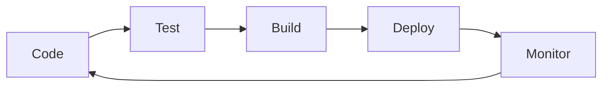

<!-- ===== HEADER SECTION ===== -->
<div align="center">

<!-- Animated Terminal Header --><!-- Anime GIF -->
<p align="center">
  
</p>

<br/>

<!-- Profile Badge (with spacing below) -->
<p align="center">
  
</p>

<!-- ===== HEADER SECTION ===== -->
<div align="center">
  
  <br/>
  <h1>Hi, I'm <span style="color:#0e75b6">Piyush Soni</span> 👋</h1>
  <b>MERN Stack Developer</b> <br/>
  <em>AI/ML Explorer | Web Development | Open Source | Java (Backup)</em>
  <br><br>
  
  
  
  
  
  
  
  
  
  
  
  
  <br><br>
  <a href="mailto:piiyush.sonii@outlook.com"></a>
  <a href="https://www.linkedin.com/in/piyush64bit"></a>
  <a href="https://github.com/Piyush64-bit"></a>
  <a href="https://piyushportfolio.live"></a>
</div>

---

## 🌿 About Me

Hey! I'm **Piyush** — I build, break & ship stuff (sometimes all at once 😅). My main playground is the **MERN stack** (MongoDB, Express, React, Node.js) where I craft full-stack apps with a dash of personality. I’m also passionate about integrating **AI/ML** into real-world projects and love exploring new tech. Java is my strong backup (Core + Advanced), so I can jump into JVM land whenever needed. I thrive on clean code, creative problem-solving, and learning in public!

---

<details>
<summary>🎯 <strong>More Details</strong></summary>
<br>

## 🚀 What I Do

|                    |                                                                |
| ------------------ | -------------------------------------------------------------- |
| **Languages**      | JavaScript, TypeScript, HTML5, CSS3, Java (backup), SQL        |
| **Frameworks**     | MERN (MongoDB, Express.js, React.js, Node.js), Spring Boot     |
| **Databases**      | MongoDB, MySQL                                                 |
| **DevOps & Tools** | Git, GitHub, Docker, Postman, VS Code, IntelliJ                |
| **AI & ML**        | OpenAI, LangChain, ML basics                                   |
| **Certifications** | MERN Bootcamps, Full Stack (Groot Academy), Java 100 Days, Google Cloud Arcade |
| **Soft Skills**    | Teamwork, Communication, Problem Solving, Mentoring            |

---

## 📊 GitHub Stats

<p align="center">
  
  
  
</p>

---

## 🏅 Badges & Certifications

<p>
  
  
  
  
  
  
</p>

---

## 🎯 Current Focus

- 🟢 Building and scaling MERN stack projects (my main jam!)
- 🤖 Integrating AI/ML into web apps and side projects
- ☕ Keeping my Java (Core + Advanced) skills sharp for JVM adventures
- 🌐 Building open source tools and collaborating with the community
- 📚 Learning advanced system design and scalable architectures

---

## 🌟 Featured Projects

| Project                                                                      | Description                    | Tech              |
| ---------------------------------------------------------------------------- | ------------------------------ | ----------------- |
| [C-Programs](https://github.com/Piyush64-bit/C-Programs)                     | Foundation-level C programming | C                 |
| [CPP-Programs](https://github.com/Piyush64-bit/CPP-Programs)                 | Advanced C++ and DSA           | C++               |
| [Java-Programs](https://github.com/Piyush64-bit/Java-Programs)               | 100 Days of Java (backup stack) | Java              |
| [AdvanceJava-Programs](https://github.com/Piyush64-bit/AdvanceJava-Programs) | Enterprise Java, Spring Boot (backup) | Java, Spring Boot |

---

## 🤝 Let’s Connect

<p>
  <a href="mailto:piiyush.sonii@outlook.com"></a>
  <a href="https://www.linkedin.com/in/piyush64bit"></a>
  <a href="https://github.com/Piyush64-bit"></a>
  <a href="https://piyushportfolio.live"></a>
</p>

---

<p align="center">
  <sub>Made with ❤️ | Last updated: August 2025 | Looks great in both light & dark mode</sub>
</p>
<td width="50%" align="center">

### ☁️ **Cloud Expedition**


```yaml
Google Cloud: ████████░░░░░ 70%
Kubernetes: ██████░░░░░░░ 50%
Infrastructure: ███████░░░░░░ 60%
DevOps: ████████░░░░░ 65%
```

**Achievements:**

- 🌟 **GCP Arcade Level 3** Completed
- 🛡️ **IAM & VPC** Certified
- ⚙️ **Compute Engine** Expert

</td>
</tr>
</table>

<div align="center">
  
</div>


## 🧰 Technology Arsenal & Weapon Cache

<div align="center">

<!-- Hacker-style Header -->


<!-- Binary Background -->


</div>

<!-- Real-time Skills Dashboard -->
<div align="center">

### 💻 **Active Tech Stack Monitor**

```yaml
System Status: [ONLINE] ████████████████████ 100%
Last Updated: July 2025
Performance: OPTIMIZED
Skill Tree: EXPANDING
```

<!-- Animated Tech Stack -->
<table>
<tr>
<td align="center" width="20%">
<br>

</td>
<td align="center" width="20%">
<br>

</td>
<td align="center" width="20%">
<br>

</td>
<td align="center" width="20%">
<br>

</td>
<td align="center" width="20%">
<br>

</td>
</tr>
</table>

### 🎨 **Frontend Universe**


### 🛠️ **Backend Powerhouse**


### 🗄️ **Data Storage**


### ☁️ **Cloud & DevOps**


### 🎯 **Tools & Design**


</div>

<!-- Interactive Skill Cards -->
<details>
<summary>� <strong>Detailed Skill Breakdown</strong></summary>
<br>

<table>
<tr>
<td width="50%">

**🎨 Frontend Mastery**

```javascript
const frontendSkills = {
  languages: ["JavaScript", "TypeScript", "HTML5", "CSS3"],
  frameworks: ["React.js", "Next.js", "Tailwind CSS"],
  tools: ["Vite", "Webpack", "Framer Motion"],
  design: ["Figma", "Responsive Design", "UI/UX"],
};
```

**🛠️ Backend Engineering**

```java
public class BackendExpertise {
  private String[] languages = {"Java", "JavaScript"};
  private String[] frameworks = {"Spring Boot", "Express.js"};
  private String[] databases = {"MySQL", "MongoDB", "PostgreSQL"};
  private String[] concepts = {"REST APIs", "Microservices", "OOP"};
}
```

</td>
<td width="50%">

**☁️ Cloud & Infrastructure**

```yaml
Cloud Platforms:
  - Google Cloud Platform (GCP)
  - Compute Engine, VPC, IAM
  - Kubernetes & Container Orchestration

DevOps Tools:
  - Docker & Containerization
  - CI/CD Pipelines
  - Git Version Control

Deployment:
  - Netlify, Vercel
  - Cloud Functions
  - Load Balancing
```

**📊 Development Workflow**



</td>
</tr>
</table>

</details>


## � Learning Laboratory

<div align="center">


_These repositories aren't just practice — they're my **digital evolution** documented in code._

</div>

<table>
<tr>
<td align="center" width="25%">


### **[C-Programs](https://github.com/Piyush64-bit/C-Programs)**

```c
// Foundation Level
#include <stdio.h>
int main() {
    printf("Building blocks!");
    return 0;
}
```

_From basic syntax to advanced pointers, memory management, and system programming fundamentals._

**Key Concepts:** Pointers, File I/O, Data Structures

</td>
<td align="center" width="25%">


### **[CPP-Programs](https://github.com/Piyush64-bit/CPP-Programs)**

```cpp
// Object-Oriented Power
class Skills {
    public:
        void advance() {
            cout << "Level up!";
        }
};
```

_Advanced OOP concepts, STL mastery, algorithm optimization, and competitive programming solutions._

**Key Concepts:** OOP, STL, Algorithms, DSA

</td>
<td align="center" width="25%">


### **[Java-Programs](https://github.com/Piyush64-bit/Java-Programs)**

```java
// 100 Days Journey
public class JavaMastery {
    static int progress = 100;
    // Core to Advanced
}
```

_Complete Java journey: Core fundamentals, OOP mastery, design patterns, and enterprise development._

**Key Concepts:** Core Java, OOP, Collections, Multithreading

</td>
<td align="center" width="25%">


### **[AdvanceJava-Programs](https://github.com/Piyush64-bit/AdvanceJava-Programs)**

```java
// Enterprise Ready
@SpringBootApplication
public class WebDevelopment {
    // JDBC, Servlets, JSP
}
```

_Enterprise Java development: JDBC, Servlets, JSP, Spring framework, and full-stack web applications._

**Key Concepts:** Web Development, Spring, Database Integration

</td>
</tr>
</table>

<div align="center">

### 📈 **Learning Analytics**


</div>


## 🏆 Achievements & Recognition

<div align="center">


</div>

<table>
<tr>
<td width="50%" align="center">

### 🎓 **Professional Certifications**


```yaml
Credentials: ✅ Full Stack Development - Certified
  ✅ Java Programming - Advanced Level
  ✅ AI/ML & Data Analytics - Qualified
  ✅ Frontend Development - Expert

Institution: Groot Software Academy
Status: Active Learning & Building
```

**Skills Validated:**

- 🎨 Modern Web Development
- ☕ Enterprise Java Applications
- � Machine Learning Fundamentals
- 📊 Data Analysis & Visualization

</td>
<td width="50%" align="center">

### ☁️ **Google Cloud Mastery**


```yaml
Google Cloud Journey: 🌟 Arcade Program 2025 - Level 3 Achieved
  🛡️ VPC & IAM Security - Certified
  ⚙️ Compute Engine - Infrastructure Expert
  ☸️ Kubernetes Engine - Container Orchestration

Current Level: Advanced Practitioner
Next Target: Professional Cloud Architect
```

**Cloud Expertise:**

- 🏗️ Infrastructure Design & Management
- 🔐 Security & Identity Access Management
- 📦 Containerization & Orchestration
- 🚀 Scalable Application Deployment

</td>
</tr>
</table>

<div align="center">

### 🌟 **Professional Profile**

<a href="https://www.cloudskillsboost.google/public_profiles/8de7c885-cade-4966-9777-f1f109ab6c44" target="_blank">
  
</a>

<!-- Achievement Badges -->


</div>


## 🌐 Connect & Collaborate

<div align="center">


### 💫 _Ready to turn ideas into digital reality?_

</div>

<table>
<tr>
<td width="33%" align="center">

### 🤝 **Professional**


<br><br>

<a href="https://www.linkedin.com/in/piyush64bit">
  
</a>

<br><br>

<a href="https://drive.google.com/uc?export=download&id=1ZdEUm7xN_zrC6S7OYtaIF2lyLhWQGp_R">
  
</a>

**Let's network and grow together!**

</td>
<td width="33%" align="center">

### 📱 **Get in Touch**


<br><br>

<a href="mailto:piiyush.sonii@outlook.com">
  
</a>

<br><br>

<a href="https://wa.me/919660283856">
  
</a>

<a href="tel:+919660283856">
  
</a>

**Direct communication for opportunities!**

</td>
<td width="33%" align="center">

### 🎉 **Social Presence**


<br><br>

<a href="https://twitter.com/PUNYAPAAP0001">
  
</a>

<br><br>

<a href="https://instagram.com/pii.yush">
  
</a>

**Join my tech journey & updates!**

</td>
</tr>
</table>

<div align="center">

### 🌟 **Portfolio Showcase**

<a href="https://piyushportfolio.live">
  
</a>

_Discover my projects, skills, and professional journey in an interactive experience!_

</div>


## 📊 GitHub Analytics & Performance

<div align="center">


### 📈 _My development journey visualized through data_

</div>

<!-- Comprehensive Stats Layout -->
<table>
<tr>
<td width="50%" align="center">


</td>
<td width="50%" align="center">


</td>
</tr>
</table>

<!-- Activity Graph -->
<div align="center">
  
</div>

<br>

<!-- Detailed Analytics -->
<table>
<tr>
<td width="33%" align="center">

### 🔥 **Contribution Streak**


</td>
<td width="33%" align="center">

### 🏆 **Achievement Showcase**


</td>
<td width="33%" align="center">

### 📊 **Coding Metrics**

```yaml
Total Commits: 1000+
Active Repos: 15+
Languages: 8+
Frameworks: 12+

Primary Focus:
  - Java Development: 40%
  - Frontend React: 30%
  - Cloud & DevOps: 20%
  - Learning & R&D: 10%

Productivity Stats:
  - Best Coding Time: 🌙 Night Owl
  - Preferred IDE: VS Code & IntelliJ
  - Commit Style: Meaningful & Clean
```

</td>
</tr>
</table>

<!-- Interactive Elements -->
<details>
<summary>📋 <strong>Detailed Development Insights</strong></summary>
<br>

<table>
<tr>
<td width="50%">

**🎯 Current Year Goals**

- [ ] Complete Advanced Spring Boot Course
- [ ] Deploy 5 Full-Stack Projects
- [ ] Earn Google Cloud Professional Certification
- [ ] Contribute to 10 Open Source Projects
- [x] Master React Performance Optimization
- [x] Complete 100 Days of Java Challenge

**📈 Growth Metrics**

- **Code Quality:** Increased by 25% this year
- **Project Completion:** 8 major projects delivered
- **Learning Velocity:** 3 new technologies mastered
- **Community Engagement:** 50+ meaningful contributions

</td>
<td width="50%">

**🔬 Technical Analysis**

```javascript
const developerProfile = {
  experience: "2+ years",
  focusAreas: ["Full-Stack", "Cloud", "Backend"],
  strengthAreas: {
    problemSolving: "95%",
    codeQuality: "90%",
    teamwork: "95%",
    learning: "100%",
  },
  currentProject: "Enterprise Java Application",
  nextGoal: "System Design Mastery",
};
```

**⚡ Recent Activity Highlights**

- 🚀 Deployed React + Spring Boot app
- 📚 Completed Microservices architecture study
- 🛠️ Optimized database queries (40% performance boost)
- 🎯 Implemented CI/CD pipeline for personal projects

</td>
</tr>
</table>

</details>


<div align="center">

### ✨ _Thank You for Visiting!_ ✨


<!-- Animated Terminal Farewell -->


<!-- Snake Animation -->


<br><br>

> ### 💭 _"Code is poetry written in logic, and every bug is just a plot twist waiting for resolution."_

<br>

**🚀 Ready to transform ideas into digital reality? Let's connect and create something extraordinary! 🚀**

<br>

<!-- Tech Stats Footer -->
<table>
<tr>
<td align="center">

</td>
<td align="center">

</td>
<td align="center">

</td>
<td align="center">

</td>
</tr>
</table>

<!-- Footer Matrix Animation -->


<sub>💡 This README was crafted with ❤️, lots of ☕, and a passion for beautiful code | Last updated: July 2025 🚀</sub>

</div>

