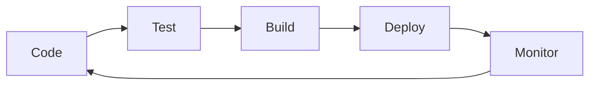

<!-- ===== HEADER SECTION ===== -->
<div align="center">

<!-- Animated Terminal Header -->


<!-- Matrix-style Background -->


<!-- Cyberpunk Style Typing SVG -->


<!-- Animated Wave -->


<!-- Hacker-style Profile Animation -->


<!-- Tech Stack Ticker -->


<!-- Gradient Line -->


<!-- Profile Views with Animation -->


<!-- Social Media Preview -->
<p>
  <a href="https://piyushportfolio.live"></a>
  <a href="https://www.linkedin.com/in/piyush64bit"></a>
  <a href="mailto:piiyush.sonii@outlook.com"></a>
</p>

<!-- Live Stats Dashboard -->


<!-- Current Status Indicators -->
<br><br>


</div>

<!-- Animated Divider -->


---

## âš¡ Live Coding Activity & System Stats

<div align="center">

<!-- Terminal Activity Monitor -->


</div>

<!-- Live Metrics Dashboard -->
<table>
<tr>
<td width="33%" align="center">

### 🔥 **Current Sprint**


</td>
<td width="33%" align="center">

### 📊 **Language Usage**


</td>
<td width="33%" align="center">

### 🚀 **Contribution Streak**


</td>
</tr>
</table>

<!-- Real-time System Monitor -->
<div align="center">

### 💻 **System Resource Monitor**
```bash
╭─ piyush@dev-machine ~/projects
╰─$ system_monitor --live
┌─────────────────────────────────────────────────────────────┐
│ Process Monitor                                  [██████████] │
├─────────────────────────────────────────────────────────────┤
│ ☕ Coffee Levels:     ████████████████████████ 95%         │
│ 🧠 Creativity:       ██████████████████████   88%          │
│ 💡 Problem Solving:  ████████████████████████ 98%         │
│ 🚀 Productivity:     ███████████████████████  92%          │
│ 🔥 Passion:          ████████████████████████ 100%        │
└─────────────────────────────────────────────────────────────┘
```

<!-- Live Commit Activity -->


</div>


---

## 📚 Learning Laboratory

<div align="center">


*These repositories aren't just practice — they're my **digital evolution** documented in code.*

</div>

<table>
<tr>
<td align="center" width="25%">

##  About Me

<!-- Real-time Terminal Display -->
<div align="center">

</div>

<table>
<tr>
<td width="40%">

<div align="center">
  <!-- Animated Developer Avatar -->
  
  
  <!-- Dynamic Code Status -->
  
</div>

</td>
<td width="60%">

### 🚀 Mission Statement
> *I'm **Piyush** — a passionate developer who transforms ideas into digital reality. I don't just write code; I craft experiences that resonate with users and solve real-world challenges.*

<!-- Interactive Terminal Output -->
<details>
<summary>🎯 <strong>./run_passion_analysis.sh</strong></summary>
<br>

```bash
#!/bin/bash
# Passion Analysis Script v2.0

echo "Analyzing developer DNA..."
passion_level="MAXIMUM"
coffee_dependency="CRITICAL"
debugging_skill="LEGENDARY"

echo "Results:"
```

```javascript
const piyush = {
    passion: ["Frontend Wizardry", "Backend Architecture", "Cloud Innovation"],
    currentFocus: "Building scalable solutions with modern tech",
    lifePhilosophy: "Code with purpose, learn with curiosity",
    funFact: "I debug with coffee and deploy with confidence! ☕",
    
    // Tech Stack DNA
    preferredOS: "Linux > Windows",
    IDE: "VS Code + IntelliJ IDEA",
    debuggingMethod: "console.log() && System.out.println()",
    favoriteBracket: "{ } // Because they hug my code ❤️"
};

// Recursive learning function
function continuousLearning() {
    while(true) {
        learnNewTech();
        buildCoolStuff();
        shareKnowledge();
    }
}
```

**Core Expertise & Power Level:**
- ⚛️ **Frontend Mastery** → React, TypeScript, Next.js `[████████████] 95%`
- ☕ **Backend Engineering** → Java, Spring Boot, APIs `[██████████░] 90%`
- 🐬 **Data & Cloud** → MySQL, MongoDB, GCP `[████████░░░] 85%`
- 🚀 **DevOps Culture** → CI/CD, Kubernetes, Docker `[███████░░░░] 75%`

</details>

</td>
</tr>
</table>

<div align="center">
  
### 💭 Dev Mantra & Philosophy
<!-- Matrix-style Code Rain -->


<!-- Live System Monitor -->
<table>
<tr>
<td align="center">

</td>
<td align="center">

</td>
<td align="center">

</td>
<td align="center">

</td>
</tr>
</table>

</div>


---

## 🎯 Current Focus & Growth

<div align="center">


</div>

<!-- Progress Cards -->
<table>
<tr>
<td width="50%" align="center">

### 📚 **Learning Journey**


```yaml
Advanced Java: ████████████░ 95%
Spring Boot:   ██████████░░░ 80%
React Mastery: ███████████░░ 85%
Cloud-Native:  ███████░░░░░░ 60%
```

**Focus Areas:**
- 🏗️ **Microservices Architecture**
- âš¡ **Performance Optimization**  
- 🔧 **Advanced Design Patterns**

</td>
<td width="50%" align="center">

### ☁️ **Cloud Expedition**


```yaml
Google Cloud:  ████████░░░░░ 70%
Kubernetes:    ██████░░░░░░░ 50%
Infrastructure: ███████░░░░░░ 60%
DevOps:        ████████░░░░░ 65%
```

**Achievements:**
- 🌟 **GCP Arcade Level 3** Completed
- 🛡️ **IAM & VPC** Certified
- ⚙️ **Compute Engine** Expert

</td>
</tr>
</table>

<div align="center">
  
</div>


---

## 🧰 Technology Arsenal & Weapon Cache

<div align="center">

<!-- Hacker-style Header -->


<!-- Binary Background -->


</div>

<!-- Real-time Skills Dashboard -->
<div align="center">

### 💻 **Active Tech Stack Monitor**
```yaml
System Status: [ONLINE] ████████████████████ 100%
Last Updated: July 2025
Performance: OPTIMIZED
Skill Tree: EXPANDING
```

<!-- Animated Tech Stack -->
<table>
<tr>
<td align="center" width="20%">
<br>

</td>
<td align="center" width="20%">
<br>

</td>
<td align="center" width="20%">
<br>

</td>
<td align="center" width="20%">
<br>

</td>
<td align="center" width="20%">
<br>

</td>
</tr>
</table>

### 🎨 **Frontend Universe**


### 🛠️ **Backend Powerhouse**  


### 🗄️ **Data Storage**


### ☁️ **Cloud & DevOps**


### 🎯 **Tools & Design**


</div>

<!-- Interactive Skill Cards -->
<details>
<summary>� <strong>Detailed Skill Breakdown</strong></summary>
<br>

<table>
<tr>
<td width="50%">

**🎨 Frontend Mastery**
```javascript
const frontendSkills = {
  languages: ["JavaScript", "TypeScript", "HTML5", "CSS3"],
  frameworks: ["React.js", "Next.js", "Tailwind CSS"],
  tools: ["Vite", "Webpack", "Framer Motion"],
  design: ["Figma", "Responsive Design", "UI/UX"]
};
```

**🛠️ Backend Engineering**
```java
public class BackendExpertise {
  private String[] languages = {"Java", "JavaScript"};
  private String[] frameworks = {"Spring Boot", "Express.js"};
  private String[] databases = {"MySQL", "MongoDB", "PostgreSQL"};
  private String[] concepts = {"REST APIs", "Microservices", "OOP"};
}
```

</td>
<td width="50%">

**☁️ Cloud & Infrastructure**
```yaml
Cloud Platforms:
  - Google Cloud Platform (GCP)
  - Compute Engine, VPC, IAM
  - Kubernetes & Container Orchestration
  
DevOps Tools:
  - Docker & Containerization
  - CI/CD Pipelines
  - Git Version Control
  
Deployment:
  - Netlify, Vercel
  - Cloud Functions
  - Load Balancing
```

**📊 Development Workflow**


</td>
</tr>
</table>

</details>


---


---

<div align="center">

### ✨ *Thank You for Visiting!* ✨


<!-- Animated Terminal Farewell -->


<!-- Snake Animation -->


<br><br>

> ### 💭 *"Code is poetry written in logic, and every bug is just a plot twist waiting for resolution."*

<br>

**🚀 Ready to transform ideas into digital reality? Let's connect and create something extraordinary! 🚀**

<br>

<!-- Tech Stats Footer -->
<table>
<tr>
<td align="center">

</td>
<td align="center">

</td>
<td align="center">

</td>
<td align="center">

</td>
</tr>
</table>

<!-- Footer Matrix Animation -->


<sub>💡 This README was crafted with ❤️, lots of ☕, and a passion for beautiful code | Last updated: July 2025 🚀</sub>

</div>
